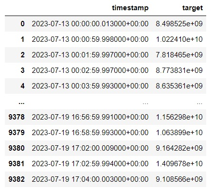
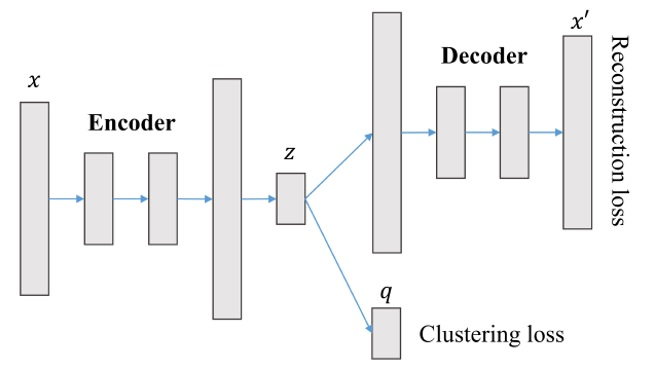
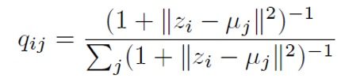
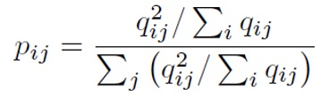
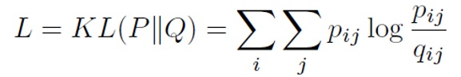
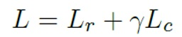
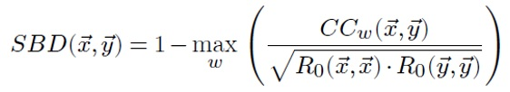
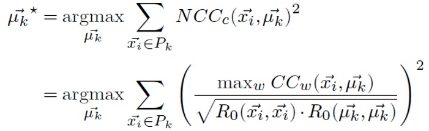

# Timeseries-clustering

Кластеризация временных рядов, отображающих значения параметров устройств аппаратного обеспечения, измеренных во времени. 
Кластеризация производится несколькими алгоритмами кластеризации временных рядов - N2D, IDEC, K-Shape.
Качество кластеризации оценивается по метрикам: коэффициент силуэта, Calinski-Harabasz Index, Davies-Bouldin Index.
Оптимальное количество кластеров определяется по метрикам: коэффициент силуэта, Локтевой метод (Elbow method), статистика разрыва (gap statistic).

## Оглавление

- [Данные](#данные)
- [Предобработка рядов](#предобработка-рядов)
- [Метрики](#метрики)
- [Методы кластеризации](#методы-кластеризации)

## Данные

Временные ряды - значения параметров устройств аппаратного обеспечения, измеренных во времени.  
Формат названия - monitoringMetric$*идентификатор*_*категория периода*  
Категория периода - название периода, за который хранятся значения во временном ряду.  Возможные значения - DAY, WEEK, MONTH, HALF_YEAR, INFINITE.

Пример:

ряд 'monitoringMetric$20221722__WEEK':

## Предобработка рядов

- усечение рядов периода до заданных границ (левая граница = медиана начального времени по всем рядам периода + 10мин 
  правая граница = медиана последнего времени по всем рядам периода - 10мин) 
- ресемплирование с заданной частотой 
- интерполирование получаемых после ресемплирования пустых значений 
- удаление пустых рядов, которые могли появиться снова после усечения 
- удаление константных рядов 
- minmax-масштабирование 

**Downsampling** (уменьшение разрешения, децимация) - уменьшение частоты дискретизации временного ряда. 
**Upsampling** (увеличение разрешения) - увеличение частоты дискретизации временного ряда. 
**Ресемплирование** - Downsampling с последующим Upsampling. Появляющиеся в результате отсутствующие значения заполняются, например, интерполяцией. 
Получаемый в результате временной ряд будет с более низким разрешением, что ускоряет вычисления.

## Метрики

### Неконтролируемые метрики качества (метки неизвестны)
- **коэффициент силуэта**
- **Calinski-Harabasz Index** 
  Отношение суммы междукластерных дисперсий к внутрикластерным дисперсиям для всех кластеров (внутрекластерная дисперсия - сумма квадратов расстояний от точек до центров их кластеров, междукластерная дисперсия - сумма квадратов расстояний от центров кластеров до центра всех точек выборки, умноженных на количество точек в кластере).
- **Davies-Bouldin Index** 
  Среднее «сходство» между кластерами, где сходство — это мера, которая сравнивает расстояние между кластерами с размером самих   кластеров.

### Метрики для выбора количества кластеров
- **коэффициент силуэта**
- **Локтевой метод (Elbow method)** 
  Строится график зависимости суммы квадратов внутрикластерных расстояний от количества кластеров. 
  Изгиб указывает на то, что дополнительные кластеры после определенного не имеют большого значения
- **статистика разрыва (gap statistic)** 
  Статистика разрыва сравнивает сумму внутрикластерных расстояний с их ожидаемыми значениями при нулевом (как правило 
  равномерном) эталонном распределении данных. 
  Делается кластеризация выборки из нулевого распределения.
  Считается логарифм отношения суммы внутрикластерных расстояний для выборки из нулевого распределения к сумме внутрикластерных   расстояний нашей кластеризации. 
  Оптимальное количество кластеров - значение, при котором статистика разрыва максимальна. Это означает, что структура кластеризации далека от случайного равномерного распределения точек.

## Методы кластеризации

### N2D
- Обучаем и применяем **автоэнкодер** к необработанным данным, чтобы узнать начальные представления точек - эмбеддинги.  Функция потерь - MSE
- Дообучаем полученные эмбеддинги с помощью поиска более кластеризируемых представлений  методом **UMAP** - методом обучения многообразиям, который сохраняет локальные расстояния.
 UMAP - алгоритм, похожий на t-SNE, но с более сильным математическим обоснованием. При снижении размерности UMAP сначала выполняет построение взвешенного графа, соединяя ребрами только те объекты, которые являются ближайшими соседями. Множество из ребер графа — это нечёткое множество с функцией принадлежности, она определяется как вероятность существования ребра между двумя вершинами. Затем алгоритм создает граф в низкоразмерном пространстве и приближает его к исходному, минимизируя сумму дивергенций Кульбака-Лейблера для каждого ребра из множеств
- На полученных более кластеризуемых эмбеддингах мы применяем окончательный простой алгоритм кластеризации (например **GMM (GaussianMixture)**), чтобы обнаружить кластеры. 

### IDEC

+ Обучаем и применяем **автоэнкодер** к необработанным данным, чтобы узнать начальные представления точек - эмбеддинги.
+ Одновременно к выходу энкодера автоэнкодера присоединяется **слой кластеризации**, который определяет сходство эмбеддинга с каждым центром кластера.
  Вычисляется $q_{ij}$ - сходство между эмбеддингом точки $z_{i}$ и центром кластера $\mu_{j}$ с помощью t-распределения Стьюдента (также как в t-SNE алгоритме).
  Полученную величину можно интерпретировать как вероятность кластера j для точки i:

    
  
  Вычисляется $p_{ij}$ - вероятность вложенной точки $z_{i}$ в кластере $\mu_{j}$ (p называют целевым распределением):

    
  
  Центры кластеров обновляются оптимизацией функции потерь - Дивергенции Кульбака-Лейблера (KL).  На первом шаге можно инициализировать центры любым алгоритмом, например k-means:

    
  
  В течении обратного распространения вычисляются градиенты L по $z_{i}$ (передаются для обновления $f_W$ (весов автоэнкодера)) и $\mu_{j}$ (используются для обновления центров кластеров $\mu_{j}$).
  кластер объекта $i = argmax_j(q_{ij})$

  общая функция потерь:
    

  $L_{r}$ - функция потерь автоэнкодера - потеря реконструкции (MSE)
  
  $L_{c}$ - потеря кластеризации (KL)

  $\gamma > 0$ - коэффициент контролирующий степень искажения вложенного пространства. Чем больше значение, тем эмбеддинги точек будут более кластеризируемыми и менее надежными (хуже представляют исходные ряды)

### k-Shape
k-Shape основан на итерационной процедуре уточнения, аналогичной той, что используется в алгоритме k-means, но со значительными отличиями. В частности, k-Shape использует другую меру расстояния и метод вычисления центроида (центр кластера), отличный от методов k-means. Мера расстояния k-Shape пытается сохранить формы временных рядов при их сравнении. Для этого k-Shape использует меру расстояния, инвариантную к масштабированию (изменение всех значений и промежутков времени в одинаковое число раз не влияет на меру расстояния) и смещению (изменение сдвига одного ряда относительно другого не влияет на меру расстояния) - Shape-based distance (SBD).
 **Shape-based distance (SBD)** - мера которая тем меньше чем больше нормированное по автокорреляциям рядов максимальное (по всем сдвигам одного ряда относительно другого) значение кросс-корреляции рядов:

 
В k-means центроид (центр кластера) вычисляется как средняя последовательность из набора последовательностей — вычисление каждой координаты средней последовательности как среднее арифметическое соответствующих координат всех последовательностей.
 
В k-Shape вычисление центроида является задачей оптимизации, цель которой состоит в том, чтобы найти такую последовательность, что сумма квадратов расстояний (по мере SBD) до всех других последовательностей временных рядов будет максимальной:

 
 
Алгоритм кластеризации:

На каждой итерации k-Shape выполняет два шага: 
- на этапе назначения алгоритм для каждого ряда обновляет принадлежность кластеру, сравнивая каждый временной ряд со всеми вычисленными центроидами и назначая каждый временной ряд кластеру ближайшего центроида, используется мера расстояния SBD для определения принадлежности кластеру 
- на этапе уточнения центроиды кластеров обновляются, чтобы отразить изменения в составе кластеров на предыдущем этапе.

Алгоритм повторяет эти два шага до тех пор, пока либо не произойдет никаких изменений в составе кластеров, либо не будет достигнуто максимально допустимое количество итераций.
 

